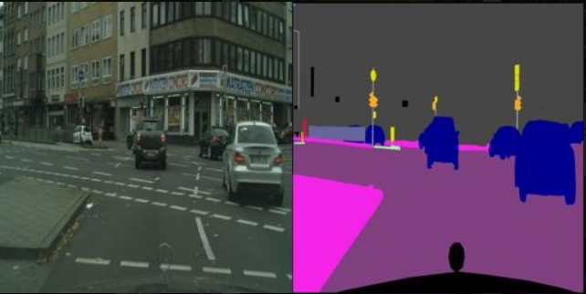
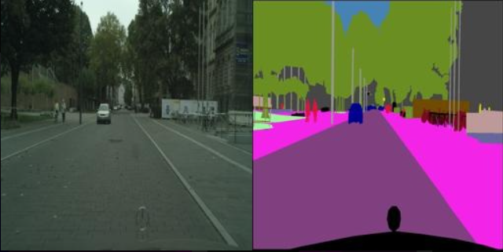
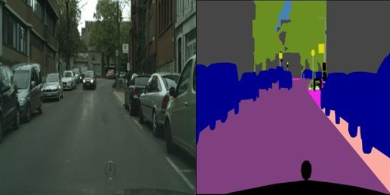

# Image-to-Image-Translation
In Image-to-Image Translation, the task is to translate images from one domain to another by learning a mapping between the input and output images, using a training dataset of aligned or unaligned cross-domain image pairs.

Results-
Street view to Normal View

